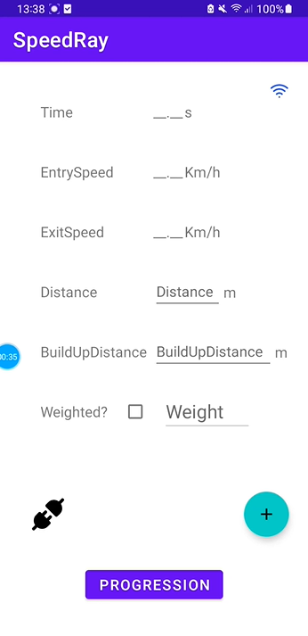

# Laser Gate Android App

## Objective
The goal of this project is to develop an Android application that stores and displays metrics sent by the laser gates.

As this is a learning project, I chose to structure my approach using the **Agile methodology**. This not only aligns with modern development practices but also increases the chances of finishing the app within a reasonable timeframe.

## 1. Backlog

### Solo Sprinter
- As a solo sprinter, I want to connect to the laser gates (ESP32) and receive live data.  
- As a solo sprinter, I want to check my history of progression.  
- As a solo sprinter, I want to input the distance between start and end gates for fly sprints.  
- As a solo sprinter, I want to switch easily between history and live data screens.  

### Coach
- As a coach, I want all the same functionalities as a solo sprinter.  
- As a coach, I want to smoothly check each of my athletes’ stats.  

### Developer
- As the developer, I want to make the app optionally connectable to a cloud computing environment.  
  (This is not a core objective for this project, but it supports learning goals and future integration with other sensor systems.)  
  (This can allow a user to sync data on diffrent devices or platforms)

## 2. Priorities
- **Core Objectives**: ESP32 connectivity, live data view, history tracking, basic navigation.  
- **Nice-to-have**: Coach view with multiple athletes.  
- **Stretch goal**: Cloud integration.  

## 3. Sprint Plan

Old plan : 
- **Sprint 1**: Implement ESP32 and Android connection and display live metrics.  
- **Sprint 2**: Add UI for history tracking and progression.  
- **Sprint 3**: Add navigation between screens and input for distance.  
- **Sprint 4**: Explore coach mode and optional cloud integration.

New Plan: (Changed after Sprint3)

- **Sprint 1** Connect Android and ESP32 and get JSON data.
- **Sprint 2** Create a Database that will save sprint data and create a new activity that will dispaly this data.
- **Sprint 3** Add input for other metrics of a sprint and save data to the database
- **Sprint 4** Fix connection issue (At sprint 1 the connection to the ESP32 needs to happen manually before starting the app so i can receive data).
- **Sprint 5** Display the data received from the ESP32 on the UI.
- **Sprint 6** Fill progression UI with summary of sprint data (best performance and latest).
- **Sprint 7** Add a fragment that is hosted at progression UI that shows performances in a table format.
- **Sprint 8** Add another fragment that is hosted at progression UI that displays plots of performances.
- **Sprint 9** Add a filter features to the plot fragment.
- **Sprint 10** Clean and improve UI.
- **Sprint 11**: Explore coach mode and optional cloud integration.

## 4. Progression

- **Sprint1** 

Commit [522aaba](https://github.com/FIRMach16/Laser-Gates-project/commit/522aabaf8479d2bff61edae24ca2eef53074db42):

Managed to get data from the esp32 server however this is just is printed out on Logcat and is not updating the UI.(delayed by 2 days on the expected timeframe mainly due to learning process).

Problems to fix : 
1. App don't connect automatically to the ESP32 network (Right now I need to connect manually).
2. The communication happen in plaintext (potential security issues?) [config](./AndroidApp/app/src/main/res/xml/network_security_config.xml).
3. Multipe @Serialisable data classes may not be the correct way to go for data acquisition.

**Demo on physical emulator using the logging utility:**

---

- **Sprint2**:

Commit [38dd751](https://github.com/FIRMach16/Laser-Gates-project/commit/38dd751fd0f1cd3e7ac738c5234af2f2d578eb54)

For now, I made another empty activity to have this ui :

Live Data UI (Entry point for now) | Progression UI
:---------------------------------:|:----------------------:
 |   

 And also managed to create a database (using the singelton design pattern) and got to save some test data in that database (The data is showcased for now in the logs).

Problems to fix/ features that need to be developed:
1. Progression UI will show a summary of the best and latest stat of the sprinter and 2 buttons leading to other fragments.
2. One fragment will have a recycler view to show the all the data in a table format 
3. The other fragment will show in graph form the evolution of the times of the sprinter and will include a filter feature (for example filter by distance ,weight , ..etc).
4. A feature that allows entry deletion will also be useful.

---

- **Sprint3**

Commit [71d9214](https://github.com/FIRMach16/Laser-Gates-project/commit/71d921470f3a0635c264b6bf903742cba5b3f27f)

In this sprint i added other Views in the main UI that allows me to input metrics suchs as (Distance between gates , build up distance and wether the sprinter is weighted or not) I also added a FAB (Floating action button) that clear the table (just for testing purposes) and add a sprint to the database with some metrics chosen randomly (time,entrySpeed & exitSpeed), some chosen deliberately (Date is the date of the button click) and the rest are chosen by the user. Click the image bellow to see the video demo:

 
- **Sprint4**

Commit [2c8e504](https://github.com/FIRMach16/Laser-Gates-project/commit/2c8e50424f5622893f051a0fb58c7ef2f205b3d3)

From this point i decided that i won't use AI nor stackoverflow for programmig, just official documentation to complete this app, this will deepen my understanding of software engineering in general.

In this sprint i fixed the connection issue, so that when the app request the network if the requested network is available it connects to it (By just adding the BSSID (MAC Adress)) , i also added a button that sends this connection request (ImageButtton at the bottom left) and an indicator (ImageView at top right corner) that change it's source image to indicate if the app is connected to the ESP32 network or not.

This video will demonstrate these changes (the icon at the left belongs to the screen recorder app that i used):

