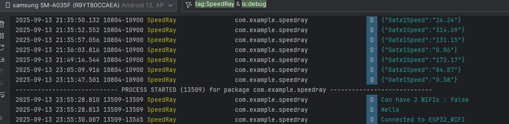

# Laser Gate Android App

## Objective
The goal of this project is to develop an Android application that stores and displays metrics sent by the laser gates.

As this is a learning project, I chose to structure my approach using the **Agile methodology**. This not only aligns with modern development practices but also increases the chances of finishing the app within a reasonable timeframe.

## 1. Backlog

### Solo Sprinter
- As a solo sprinter, I want to connect to the laser gates (ESP32) and receive live data.  
- As a solo sprinter, I want to check my history of progression.  
- As a solo sprinter, I want to input the distance between start and end gates for fly sprints.  
- As a solo sprinter, I want to switch easily between history and live data screens.  

### Coach
- As a coach, I want all the same functionalities as a solo sprinter.  
- As a coach, I want to smoothly check each of my athletes’ stats.  

### Developer
- As the developer, I want to make the app optionally connectable to a cloud computing environment.  
  (This is not a core objective for this project, but it supports learning goals and future integration with other sensor systems.)  

## 2. Priorities
- **Core Objectives**: ESP32 connectivity, live data view, history tracking, basic navigation.  
- **Nice-to-have**: Coach view with multiple athletes.  
- **Stretch goal**: Cloud integration.  

## 3. Sprint Plan
- **Sprint 1**: Implement ESP32 and Android connection and display live metrics.  
- **Sprint 2**: Add UI for history tracking and progression.  
- **Sprint 3**: Add navigation between screens and input for distance.  
- **Sprint 4**: Explore coach mode and optional cloud integration.  

## 4. progression

- **Sprint1** Managed to get data from the esp32 server still not updating UI (delayed by 2 days on the expected timeframe mainly due to learning process)

Problems to fix : (App don't connect automatically to the ESP32 network , the communication happen in plaintext (potential security issues?) [config](./AndroidApp/app/src/main/res/xml/network_security_config.xml) , polymorphism for @Serialisable data classes may not be the correct way to go)

**Demo on physical emulator using the logging utility:**

