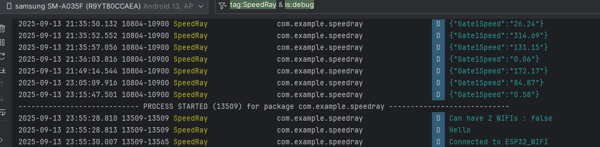
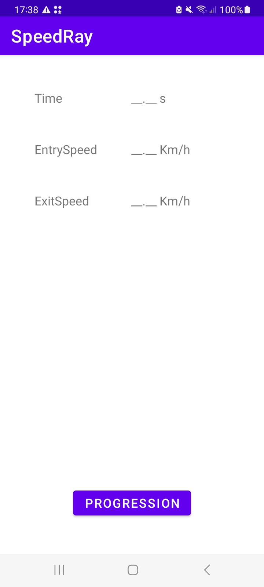
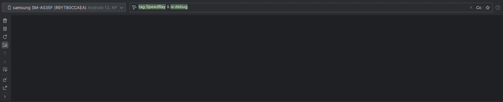
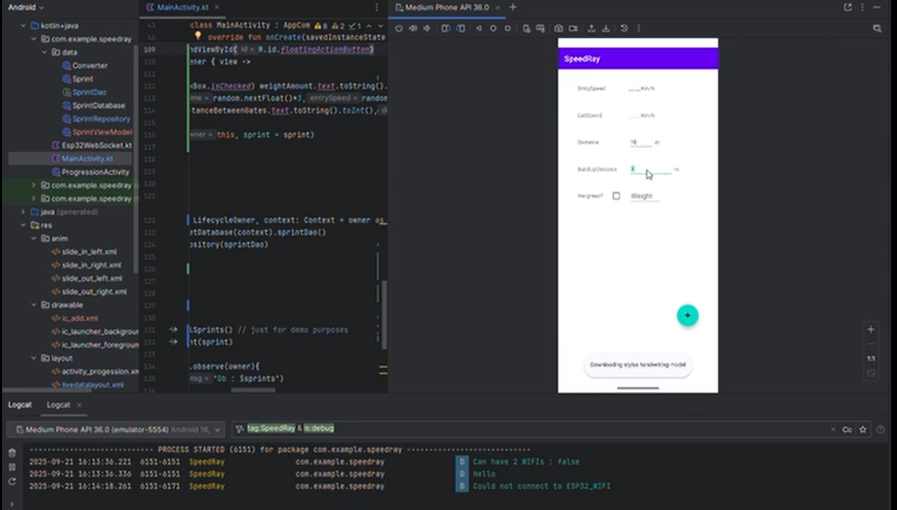

# Laser Gate Android App

## Objective
The goal of this project is to develop an Android application that stores and displays metrics sent by the laser gates.

As this is a learning project, I chose to structure my approach using the **Agile methodology**. This not only aligns with modern development practices but also increases the chances of finishing the app within a reasonable timeframe.

## 1. Backlog

### Solo Sprinter
- As a solo sprinter, I want to connect to the laser gates (ESP32) and receive live data.  
- As a solo sprinter, I want to check my history of progression.  
- As a solo sprinter, I want to input the distance between start and end gates for fly sprints.  
- As a solo sprinter, I want to switch easily between history and live data screens.  

### Coach
- As a coach, I want all the same functionalities as a solo sprinter.  
- As a coach, I want to smoothly check each of my athletes’ stats.  

### Developer
- As the developer, I want to make the app optionally connectable to a cloud computing environment.  
  (This is not a core objective for this project, but it supports learning goals and future integration with other sensor systems.)  

## 2. Priorities
- **Core Objectives**: ESP32 connectivity, live data view, history tracking, basic navigation.  
- **Nice-to-have**: Coach view with multiple athletes.  
- **Stretch goal**: Cloud integration.  

## 3. Sprint Plan
- **Sprint 1**: Implement ESP32 and Android connection and display live metrics.  
- **Sprint 2**: Add UI for history tracking and progression.  
- **Sprint 3**: Add navigation between screens and input for distance.  
- **Sprint 4**: Explore coach mode and optional cloud integration.  

## 4. Progression

- **Sprint1** 

Commit [522aaba](https://github.com/FIRMach16/Laser-Gates-project/commit/522aabaf8479d2bff61edae24ca2eef53074db42):

Managed to get data from the esp32 server however this is just is printed out on Logcat and is not updating the UI.(delayed by 2 days on the expected timeframe mainly due to learning process).

Problems to fix : 
1. App don't connect automatically to the ESP32 network (Right now I need to connect manually).
2. The communication happen in plaintext (potential security issues?) [config](./AndroidApp/app/src/main/res/xml/network_security_config.xml).
3. Multipe @Serialisable data classes may not be the correct way to go for data acquisition.

**Demo on physical emulator using the logging utility:**

---

- **Sprint2**:

For now, I made another empty activity to have this ui :

Live Data UI (Entry point for now) | Progression UI
:---------------------------------:|:----------------------:
 |   

 And also managed to create a database (using the singelton design pattern) and got to save some test data in that database (The data is showcased for now in the logs).

Problems to fix/ features that need to be developed:
1. Progression UI will show a summary of the best and latest stat of the sprinter and 2 buttons leading to other fragments.
2. One fragment will have a recycler view to show the all the data in a table format 
3. The other fragment will show in graph form the evolution of the times of the sprinter and will include a filter feature (for example filter by distance ,weight , ..etc).
4. A feature that allows entry deletion will also be useful.

---

- **Sprint3**

In this sprint i added other Views in the main UI that allows me to input metrics suchs as (Distance between gates , build up distance and wether the sprinter is weighted or not) I also added a FAB (Floating action button) that clear the table (just for testing purposes) and add a sprint to the database with some metrics chosen randomly (time,entrySpeed & exitSpeed), some chosen deliberately (Date is the date of the button click) and the rest are chosen by the user. Click the image bellow to see the video demo:

 

