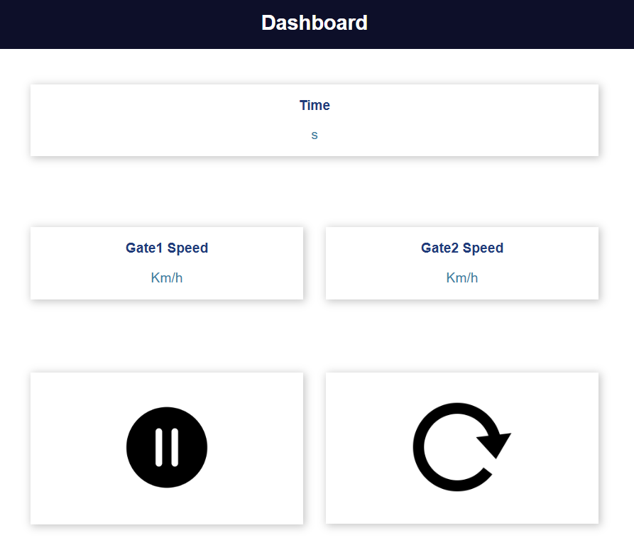

The picture below demonstrate the design of the dashbord that i made to acquire the metrics that i'm looking for in a fly sprint which are :
- Time diffrence between entry and exit in seconds
- Entry speed in Km/h 
- Exit speed in Km/h

**Note : To calculate the speed chose a distance of 10cm.**

